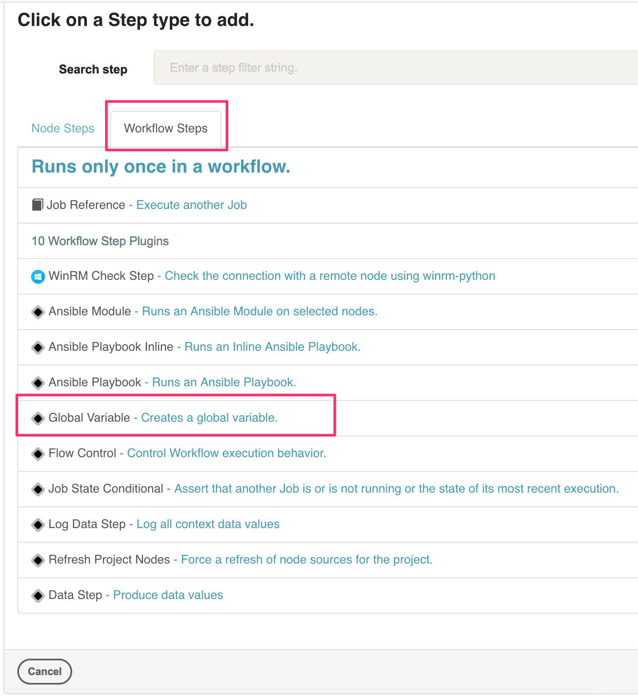
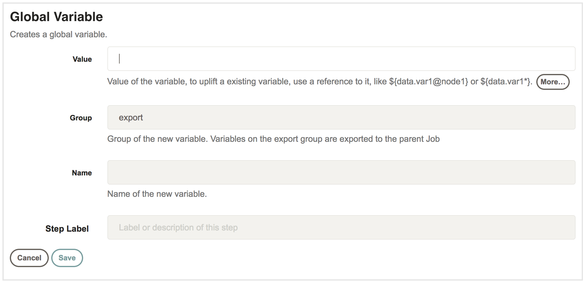

# Global variable plugin

This Rundeck plugin puts values into the global context. These values may be static or may come from the result of another workflow step.

### Configuration

This plugin is a workflow step which can be found when creating a job.

Once selected, you enter the value, group, and name of the variable.

When you run your workflow you should have the specified data in the global context after your configured workflow step runs.

